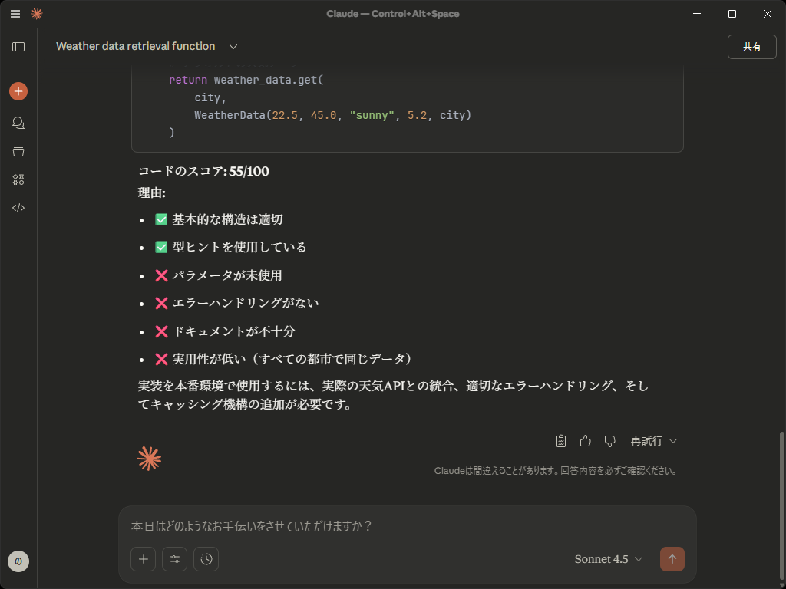
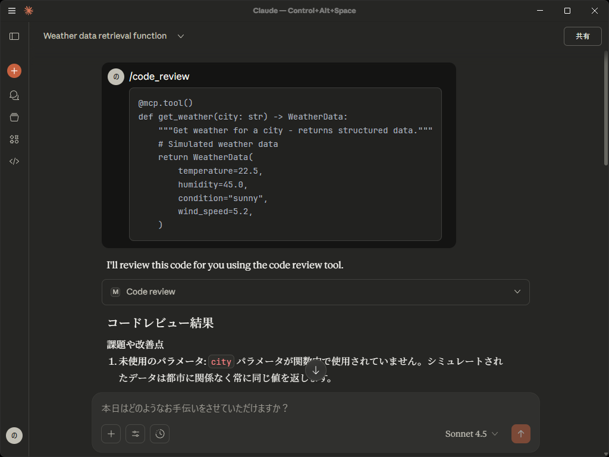

# mcp-prompt-provider

## 実行結果




```md
I'll review this code for you using the code review tool.## コードレビュー結果

### **課題や改善点**

1. **未使用のパラメータ**: `city` パラメータが関数内で使用されていません。シミュレートされたデータは都市に関係なく常に同じ値を返します。

2. **エラーハンドリングの欠如**: 無効な都市名や空文字列が渡された場合の処理がありません。

3. **型の定義が不明**: `WeatherData` クラスの定義がコード内に示されていないため、構造が不明確です（おそらくdataclassやPydanticモデル）。

4. **ドキュメントの不足**: より詳細なdocstringが必要です（パラメータの説明、戻り値の説明、例外の説明など）。

5. **テスタビリティ**: 実際のAPIとの統合を考慮した設計になっていません。

### **改善提案**

```python
from typing import Optional
from dataclasses import dataclass

@dataclass
class WeatherData:
    temperature: float
    humidity: float
    condition: str
    wind_speed: float
    city: str

@mcp.tool()
def get_weather(city: str) -> WeatherData:
    """
    指定された都市の天気情報を取得します。
    
    Args:
        city (str): 天気情報を取得する都市名
        
    Returns:
        WeatherData: 気温、湿度、天候、風速を含む天気データ
        
    Raises:
        ValueError: 都市名が空の場合
        
    Note:
        現在はシミュレートされたデータを返します。
    """
    if not city or not city.strip():
        raise ValueError("都市名は空にできません")
    
    # TODO: 実際のAPIと統合する
    # 現在はシミュレートされたデータ
    weather_data = {
        "Tokyo": WeatherData(22.5, 45.0, "sunny", 5.2, "Tokyo"),
        "London": WeatherData(15.0, 70.0, "cloudy", 8.5, "London"),
    }
    
    # デフォルトの天気データ
    return weather_data.get(
        city,
        WeatherData(22.5, 45.0, "sunny", 5.2, city)
    )
```

### **コードのスコア: 55/100**

**理由:**
- ✅ 基本的な構造は適切
- ✅ 型ヒントを使用している
- ❌ パラメータが未使用
- ❌ エラーハンドリングがない
- ❌ ドキュメントが不十分
- ❌ 実用性が低い（すべての都市で同じデータ）

実装を本番環境で使用するには、実際の天気APIとの統合、適切なエラーハンドリング、そしてキャッシング機構の追加が必要です。
```

▼ 入力内容

```
/code_review

@mcp.tool()
def get_weather(city: str) -> WeatherData:
    """Get weather for a city - returns structured data."""
    # Simulated weather data
    return WeatherData(
        temperature=22.5,
        humidity=45.0,
        condition="sunny",
        wind_speed=5.2,
    )
```
